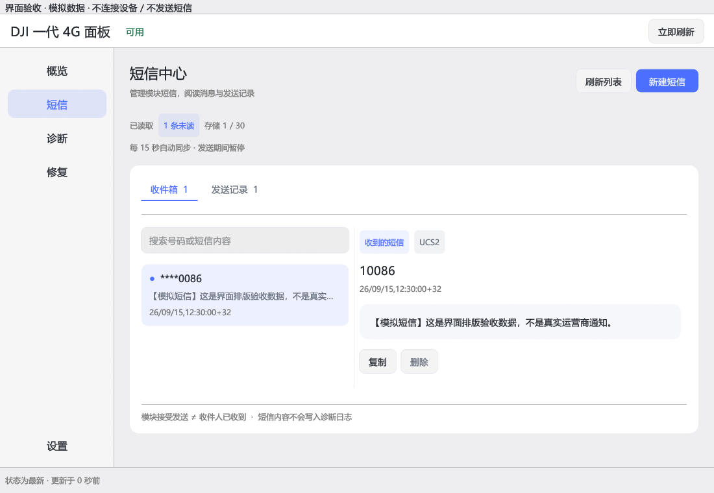
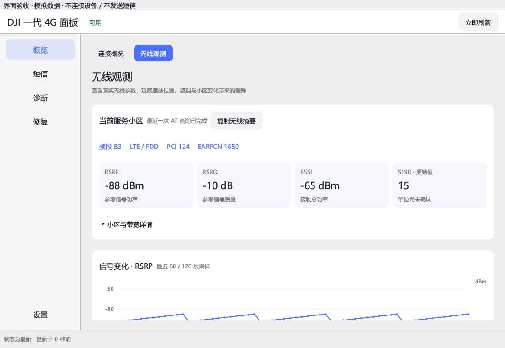

# DJI 一代 4G 面板

面向 Windows 的 DJI 第一代 4G 模块管理工具，使用 Rust + egui 构建。集中查看连接、无线参数、短信、诊断与修复操作。

[下载最新版](https://github.com/zhu-hailin/dji4g-gen1-panel/releases/latest) · [使用说明](docs/使用说明.txt) · [更新记录](docs/RELEASE_NOTES_0.1.2.md) · [安全说明](SECURITY.md)

## 短信工作区

消息列表与阅读面板分栏展示，小窗口切换为列表/详情；提供内容搜索、独立写信窗口和发送确认。操作按钮使用常规尺寸，保留紧凑的五项导航。

> 以下截图来自原生程序，内容为明确标注的模拟数据；不代表实际短信或实测信号。



- 进入短信页自动读取，停留期间每 15 秒同步；发送或修复执行中暂停查询。
- 读取可能将模块短信标记为已读。刷新保留草稿、当前筛选和仍存在的选中消息。
- 单条 UCS-2 短信，国际号码（如 `+86`）、最多 70 个 BMP 字符，不支持 Emoji 或长短信发送。
- 一次发送复用一个串口事务；显示具体失败阶段与错误码。
- **已提交**仅表示模块接受。**结果未知**时不会自动重发。

## 无线观测

在「概览 → 无线观测」中查看频段、PCI、EARFCN、Cell ID、TAC、上下行带宽与信号指标。



- RSRP、RSRQ、RSSI 使用解析后的单位；SINR 保留原始值，单位未确认时不假定为 dB。
- 保留最近 120 次 AT 采样，缺失值断开曲线；没有新回执就不重复造点。
- 保留最近 20 条小区标识变化；变化不直接等同于掉线或切换失败。
- 设备/SIM 代次变化后清空旧会话记录，可复制当前无线摘要进行比较。
- 复用已有的受控查询，不与短信发送争抢串口；不提供未经确认的频段锁、NV/QCN/IMEI 写入。

## 其他功能

- **概览**：模块与蜂窝连接、实际收发速率、SIM/设备详情、IP/接口指标。
- **诊断**：USB、AT、蜂窝、网卡、路由、绑定网卡的公网/DNS 探测、脱敏报告与变化时间线。
- **修复**：按前提、影响、确认、执行与回读结果组织；涉及提权时使用独立 helper。
- **设置**：启动、托盘、日志与常规选项。不会默认重装驱动或重置全机网络。

## 运行

### 单文件独立版

本地独立版只需复制并双击 `大疆4G面板独立版.exe`，自动准备内置程序与驱动资源并直接打开面板，无需单独安装应用或复制 DLL。驱动安装仍需管理员权限及硬件匹配。[构建与验证说明](docs/STANDALONE.md)。该版本尚未完成新电脑和卡巴斯基实机验收；含厂商驱动的本地二进制不随源码公开上传。

「修复 → 首次连接检查」分别显示 USB、Windows 网卡和 AT 通信诊断，过期结果不会显示为当前成功。公开便携包不附带厂商驱动；本地离线版可包含本机导出的原始驱动及受控安装器，参见 [离线版说明](docs/LOCAL_OFFLINE_DRIVERS.md) 和 [审核记录](docs/DRIVER_BUNDLE_REVIEW.md)。

### 未刷机模块能否用于电脑？

一代模块并非只支持无人机。[大疆官方使用说明（第 7 页）](https://dl.djicdn.com/downloads/DJI_Mavic_3/DJI_Cellular_Dongle_LTE_USB_Modem_User_Guide_v1.0.pdf)明确将 Windows 计算机列为支持设备。电脑无法上网时，应先检查 USB 驱动、SIM、网络注册和 IP 配置，不能仅凭“未刷机”判定需要更换固件。

「修复 → 电脑网卡模式」提供现有的 DJI NDIS 与 ECM 配置切换，沿用前提检查、影响确认和执行流程。此操作修改 USB 网络配置，不刷写固件；切换可能中断连接并重新枚举设备。已经能上网时无需切换，AT 端口缺少驱动时应先修复驱动。配置仅限本项目验证范围，不应把不同型号、固件的 `usbnet` 数值直接套用。

1. 从 Releases 下载 Windows x64 便携 ZIP，完整解压。
2. 运行 `dji4g-panel.exe`，保持 `dji4g-helper.exe` 在同一目录。
3. 升级前从托盘或设置页完全退出旧程序。

当前发布为**未签名开发版**。MSIX 同样为 `unsigned-development-only`；普通试用优先使用便携 ZIP。

用户已反馈短信修复版可用；自动测试、模拟截图不替代所有硬件验收。新无线观测页与不同模块固件的实际报告仍需验证。日志与诊断导出不含短信全文、完整号码或 PDU。

## 从源码构建

需要 Windows、Rust MSVC 工具链及 Visual Studio C++ 构建工具。打包 MSIX 还需要 Windows SDK 的 MakeAppx。

```powershell
cargo test --workspace --all-targets --locked
cargo clippy --workspace --all-targets --locked -- -D warnings
cargo build --release --locked --target x86_64-pc-windows-msvc -p dji4g-panel -p dji4g-helper
./packaging/scripts/build-msix.ps1
./packaging/scripts/verify-release.ps1
./packaging/scripts/build-portable.ps1
```

依赖已缓存时可加 `--offline`。GitHub Actions 在通过检查后构建未签名开发版本并发布预发布包。

## 范围与许可

目前面向第一代支持列表内的模块及 Windows x64。公开包不附带厂商驱动；不包含二代支持、固件升级、任意 AT 命令终端或自动短信重发。

MIT OR Apache-2.0，见 [LICENSE-MIT](LICENSE-MIT) 与 [LICENSE-APACHE](LICENSE-APACHE)。
