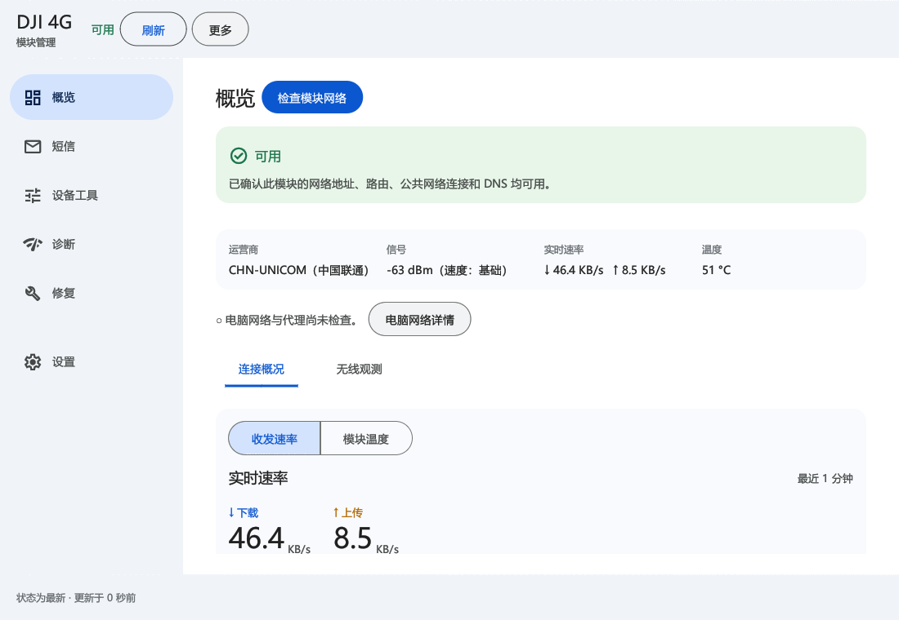
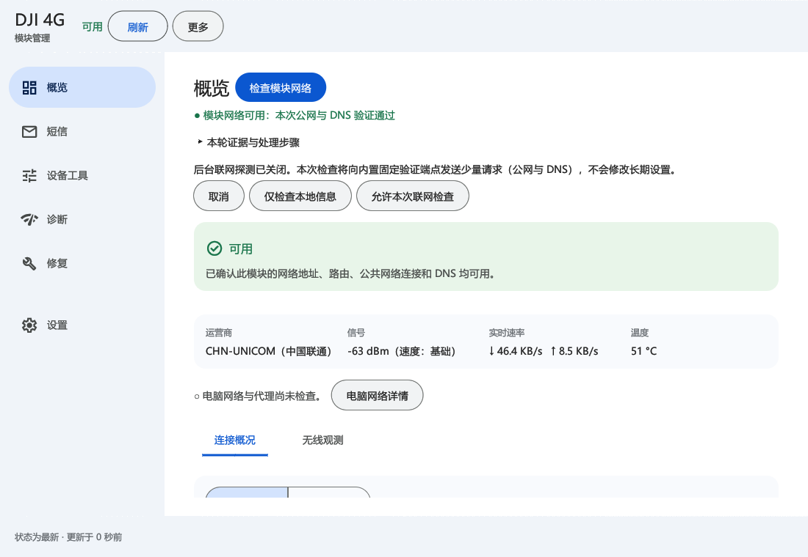
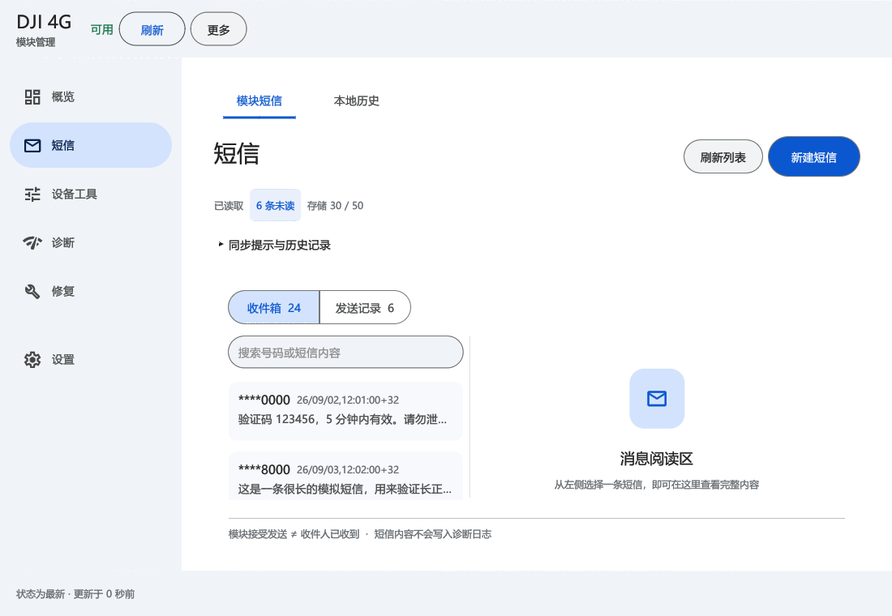
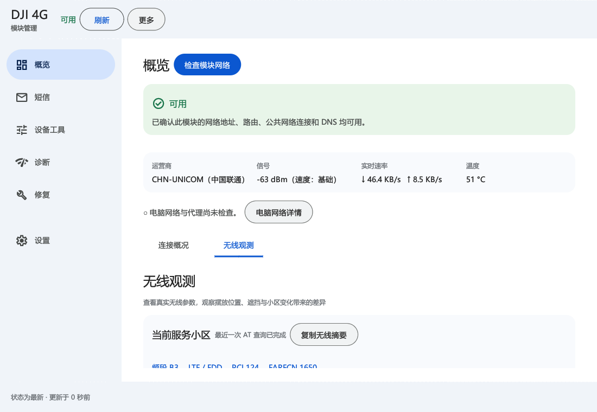

# DJI 一代 4G 面板

面向普通 Windows 用户的 DJI 第一代 4G 模块管理工具。打开后可按引导检查模块和驱动，查看信号、网络与短信；遇到连接问题时可按证据逐步排查。

[项目官网](https://lincodex.cn/index.php/archives/59/) · [下载最新版](https://github.com/zhu-hailin/dji4g-gen1-panel/releases/latest) · [使用说明](docs/使用说明.txt) · [更新记录](docs/RELEASE_NOTES_0.1.9.md) · [安全说明](SECURITY.md)

> v0.1.9 修复了原生窗口圆角内容区外的黑边；保留 v0.1.8 的 Material 3 布局。

## Material 3 全新界面

v0.1.8 按 Google Material 3 重新组织导航、页面、表单和应用内弹窗。左上角保留纯文字标题；统一使用清晰的页签、分段切换、圆角按钮、开关与状态提示。功能仍围绕模块连接、短信、网络诊断与受控修复。

- **概览**：关键读数和“检查模块网络”入口集中呈现，连接概况与无线观测使用完整页签。
- **短信**：模块短信与本地历史分开，列表减少无效留白；收件、发送记录及确认操作各有明确层级。
- **设置与修复**：采用分组信息行，开关和操作入口统一；禁用原因就近解释。
- **首次引导**：连接、检查、按需处理；底部只保留一个进入入口，不必等待全部检查完成。

> 下图由真实 egui 界面使用模拟数据离屏渲染，没有连接模块、截取桌面或打开原生窗口。用于查看布局，不代表实机联网或驱动验收。



## 第一次使用

1. 从 [GitHub Releases](https://github.com/zhu-hailin/dji4g-gen1-panel/releases/latest) 下载适合 Windows x64 的最新版，完整解压便携包。
2. 插入 SIM 卡，用支持数据传输的 USB 线连接模块，再运行 `dji4g-panel.exe`。首次引导可跳过，进入后仍能重新检查。
3. 如果系统已有适用驱动，直接使用即可。只有检查明确指出驱动问题时，再按引导选择 Windows 更新、官方支持或已校验的本地驱动资源。
4. 点击“检查模块网络”，分别查看模块自身联网结果和电脑对测试目标选择的出口。若模块通过但浏览器或代理软件不能联网，再查看“诊断 → 电脑网络与代理”。

程序不会把“短信已提交给模块”解释为对方已经收到，也不会在结果未知时自动重发。

## 检查模块网络

在概览、诊断或首次引导点击 **检查模块网络**。检查会先等待短信、设备工具或修复任务结束，再依次核实 USB、模块网卡、地址/路由、蜂窝信息，以及绑定模块网卡的网关、公网和 DNS。

- **模块网络可用**：本轮绑定模块网卡的公网与 DNS 验证通过，不借用 Wi-Fi 的联网结果；不代表所有网站、应用或双栈协议都可用。
- **发现问题**：分别说明模块未识别、链路未连接、缺地址/路由、网关、公网或 DNS 未通过。
- **尚不能判断**：未执行、无法读取或证据不足。过期与设备变化后必须重新检查，不能据此断言驱动损坏。

后台主动探测关闭时，可选择“仅检查本地信息”，或明确允许一次向内置固定端点发送少量联网请求；不会修改长期设置。IPv4/IPv6 的电脑出口按本次测试目标分别解释，Wi-Fi、VPN 或其他网卡的存在本身不是故障，也不会自动更改默认出口。

仅在证据和原有安全检查允许时，提供“更新模块网卡 DHCP 租约”或“恢复自动 DNS”；DHCP 更新后的复检仍有地址/路由问题时，才进一步提供“重启模块网卡”。**每项都单独确认**，操作后只读复检一次，并分别保留操作结果与复检结论；失败或结果未知不会自动重复写入。静态地址、未知 DNS 配置不会被猜测覆盖。



## 电脑网络与代理排查

模块能联网，不代表电脑里每个程序都走模块出口。诊断页分别显示模块通路、Windows 网卡与默认路由、系统代理及可识别的代理软件配置。正常的 VPN/TUN 接口不再单独造成“模块连接受限”。没插模块时，也能检查电脑网络。

如果 Clash Verge Rev 固定使用一张已不存在的网卡，面板会指出实际网卡名称并给出处理步骤。自动备份及修复代码仅针对 **v2.5.5、配置来源唯一且通过安全核验** 的情况设计；官方客户端隔离验收尚未完成，因此当前发布版暂不开放自动修改入口。复杂配置、其他版本、其他代理软件也只给出手动处理步骤；程序不会猜测更改订阅、脚本或 Windows 网络设置。

## 首次连接引导

首次打开会显示连接引导，自动检查 USB、网卡、AT 串口、SIM/蜂窝、公网和 DNS。可以随时跳过进入主界面；完成或跳过后会记住选择，也能从设置中重新打开引导。关闭主动探测时会明确标为尚未验证。

引导提供 DJI 官方驱动获取说明及支持入口。本地独立版内置已校验驱动时，可选择「使用内置驱动」，沿用确认、管理员授权与安装结果核验；不会自动安装。官方旧分享地址在本轮核验返回 404，因此不将失效链接作为直接下载入口。

安装完成或取消后，安装器会返回普通权限的面板，显示中文结果及下一步。需要重启、部分失败、没有匹配驱动和拔出模块会分别说明；不能因已有部分驱动就声称整台模块可用。公开包没有内置驱动时提供官方说明及 Windows 更新入口。现有本地包不匹配 MI_04，遇到该缺失接口会停止，不会强制套用其他驱动。

## 短信工作区

消息列表与阅读面板分栏展示，小窗口切换为列表/详情；提供内容搜索、独立写信窗口和发送确认。统一使用 Material 按钮与导航，窄窗口可打开菜单切换页面。

> 以下为 v0.1.8 离屏渲染的模拟界面，不代表真实短信或实测信号。



- 进入短信页自动读取，停留期间每 15 秒同步；发送或修复执行中暂停查询。
- 历史读取上限为 1000 个原始存储记录，实际数量仍取决于 SIM/模块容量；显示读取进度和无法解码的记录数，可停止。SIM 卡与模块存储区需明确选择并确认，读取后恢复原位置；读取前后核验 SIM 身份，变化时丢弃结果。
- 读取可能将模块短信标记为已读。刷新保留草稿、当前筛选和仍存在的选中消息。
- 单条 UCS-2 短信，国际号码（如 `+86`）、最多 70 个 BMP 字符，不支持 Emoji 或长短信发送。
- 一次发送复用一个串口事务；显示具体失败阶段与错误码。
- **已提交**仅表示模块接受。**结果未知**时不会自动重发。
- 收件详情可回复原始号码；已有草稿需明确选择替换，回复本身不会发送。
- 长短信保留完整 8 位或 16 位引用号。删除按确认时已读取的分片逐一核验，部分失败或结果未知时停止，保留未确认删除的分片；核验读取可能改变模块已读状态。

「本地历史」默认关闭。开启后，当前界面读到的收件短信会按设备和 SIM 分区，使用当前 Windows 用户 DPAPI 加密保存；最多 5000 条、按保存日期保留 90 天。可搜索号码/正文、按保存日期筛选，明确确认后导出全部历史为明文 TXT 或清空并关闭保存。它不能恢复已删除且从未保存的消息，也不是持续后台短信备份服务；历史副本不能操作模块。

## 设备工具与 AT 命令（高级）

日常使用先选「设备工具」里的预设查询，例如查看 SIM、信号和模块信息；每项都能单独重新查询，并显示采集时间。需要输入命令时，「只读查询」只接受程序列出的查询命令，不会修改模块配置。

「AT 命令（高级）」面向了解 AT 命令的用户，用来排查预设查询未覆盖的问题。每次只能输入一条以 `AT` 开头的文本命令，程序会检查格式，显示即将发送的完整内容，并要求逐条确认。常见的 APN、USB 网络模式和重启命令会转入对应的受控修复流程。短信发送、数据传输等需要交互的命令，以及多条串联命令均不支持；这里也不能刷写固件。

不确定命令作用时，请先使用预设查询或诊断页。命令可能改变配置或中断连接；如果发送后没有明确结果，先检查模块状态，不要立即重复执行。终端的原始回应可能含设备信息，复制或分享前请检查内容；诊断摘要不收录原始回应。「清空历史」会删除当前显示的终端记录，但不会取消正在执行的任务，此后完成的任务仍会产生新记录。

## 无线观测

在「概览 → 无线观测」中查看频段、PCI、EARFCN、Cell ID、TAC、上下行带宽与信号指标。



- RSRP、RSRQ、RSSI 使用解析后的单位；SINR 保留原始值，单位未确认时不假定为 dB。
- 保留最近 120 次 AT 采样，缺失值断开曲线；没有新回执就不重复造点。
- 保留最近 20 条小区标识变化；变化不直接等同于掉线或切换失败。
- 设备/SIM 代次变化后清空旧会话记录，可复制当前无线摘要进行比较。
- 复用已有的受控查询，不与短信发送争抢串口；不提供未经确认的频段锁、NV/QCN/IMEI 写入。

## 其他功能

- **概览**：模块与蜂窝连接、实际收发速率、SIM/设备详情、IP/接口指标。
- **诊断**：USB、AT、蜂窝、网卡、路由、绑定网卡的公网/DNS 探测、脱敏报告与变化时间线。
- **修复**：按前提、影响、确认、执行与回读结果组织；涉及提权时使用独立 helper。
- **设置**：启动、托盘、日志与常规选项。不会默认重装驱动或重置全机网络。

## 运行

### 单文件独立版

本地独立版只需复制并双击 `大疆4G面板独立版.exe`，自动准备内置程序与驱动资源并直接打开面板，无需单独安装应用或复制 DLL。驱动安装仍需管理员权限及硬件匹配。[构建与验证说明](docs/STANDALONE.md)。该版本尚未完成新电脑和卡巴斯基实机验收；含厂商驱动的本地二进制不随源码公开上传。

「修复 → 首次连接检查」分别显示 USB、Windows 网卡和 AT 通信诊断，过期结果不会显示为当前成功。公开便携包不附带厂商驱动；本地离线版可包含本机导出的原始驱动及受控安装器，参见 [离线版说明](docs/LOCAL_OFFLINE_DRIVERS.md) 和 [驱动验收记录](docs/ACCEPTANCE_20260922_BEGINNER_COMPLETION.md)。

### 未刷机模块能否用于电脑？

一代模块并非只支持无人机。[大疆官方使用说明（第 7 页）](https://dl.djicdn.com/downloads/DJI_Mavic_3/DJI_Cellular_Dongle_LTE_USB_Modem_User_Guide_v1.0.pdf)明确将 Windows 计算机列为支持设备。电脑无法上网时，应先检查 USB 驱动、SIM、网络注册和 IP 配置，不能仅凭“未刷机”判定需要更换固件。

「修复 → 电脑网卡模式」提供现有的 DJI NDIS 与 ECM 配置切换，沿用前提检查、影响确认和执行流程。此操作修改 USB 网络配置，不刷写固件；切换可能中断连接并重新枚举设备。已经能上网时无需切换，AT 端口缺少驱动时应先修复驱动。配置仅限本项目验证范围，不应把不同型号、固件的 `usbnet` 数值直接套用。

1. 从 Releases 下载 Windows x64 便携 ZIP，完整解压。
2. 运行 `dji4g-panel.exe`，保持 `dji4g-helper.exe` 在同一目录。
3. 升级前从托盘或设置页完全退出旧程序。

当前发布为**未签名开发版**。MSIX 同样为 `unsigned-development-only`；普通试用优先使用便携 ZIP。

用户已反馈短信修复版可用；自动测试、模拟截图不替代所有硬件验收。新无线观测页与不同模块固件的实际报告仍需验证。日志与诊断导出不含短信全文、完整号码或 PDU。

## 从源码构建

需要 Windows、Rust MSVC 工具链及 Visual Studio C++ 构建工具。打包 MSIX 还需要 Windows SDK 的 MakeAppx。

```powershell
cargo test --workspace --all-targets --locked
cargo clippy --workspace --all-targets --locked -- -D warnings
cargo build --release --locked --target x86_64-pc-windows-msvc -p dji4g-panel -p dji4g-helper
./packaging/scripts/build-msix.ps1
./packaging/scripts/verify-release.ps1
./packaging/scripts/build-portable.ps1
```

依赖已缓存时可加 `--offline`。GitHub Actions 在通过检查后构建未签名开发版本并发布预发布包。

## 关联项目

[个人控制中心](control-center/README.md)是独立程序，可只读查看模块状态并控制特定拯救者性能模式。它与本面板不共享代码或配置，也不需要同时安装。

## 范围与许可

目前面向第一代支持列表内的模块及 Windows x64。公开包不附带厂商驱动；不包含二代支持、固件升级、无限制 AT 命令终端或自动短信重发。

MIT OR Apache-2.0，见 [LICENSE-MIT](LICENSE-MIT) 与 [LICENSE-APACHE](LICENSE-APACHE)。
