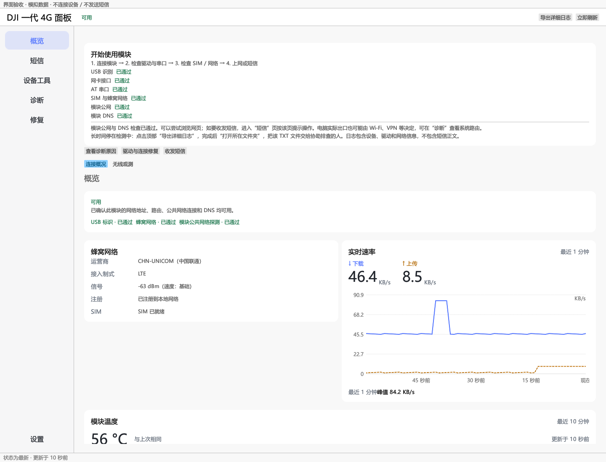

# 0.1.3 验收记录

2026-09-20，基线为 GitHub 0.1.2 (`8bc57c4`)。接收本轮温度多通道解析、温度证据和趋势图实现，复核速率轴后修正剩余问题。

## 速率轴结论

原交付会根据峰值选择整数刻度，但未固定少量顶部间距：低速仍可留出很大空白，整刻度峰值又可能贴顶。新增回归测试在旧实现上失败，修复后通过。

现在每帧以当前可见环形窗口内所有有效上传、下载样本最大值计算，上限为该值的 1.08 倍，分为四个等距区间，刻度格式化不再改变范围。旧峰值移出窗口即缩小，新的上传或下载峰值会增大范围；缺测不参与峰值计算。

- 121 KB/s 峰值：上限 130.68 KB/s。
- 模拟截图 84.2 KB/s 峰值：上限显示约 90.9 KB/s。
- 覆盖小速率、单位边界、空窗口、零值、u64 最大值、双向峰值和旧峰值移出窗口。

## 本地检查

- 格式检查、Clippy `--workspace --all-targets --offline --locked -- -D warnings` 通过。
- 工作区 `--all-targets` 测试：814 通过，0 失败、0 忽略。
- Release 构建通过；驱动结果模拟测试 6 项、安装命令模拟测试 3 项、MSIX dry-run 通过。
- 单文件包连续两次 `--verify-bundle`：17 个资源验证通过；驱动资源哈希及目录签名检查通过。未包含构建产生的 PDB 文件。
- 本地单文件程序 SHA-256：`A69AF0480C22C5346C2FB1B3B9F2F312780A555181B7D5FF42DCC9AA1E876C68`，11,097,088 字节。公开 GitHub 包不含厂商驱动，另由 CI 构建校验。

未执行真实模块写操作、发送短信或安装驱动。温度解析与界面证据使用测试及模拟数据，不能替代不同硬件、固件和安全软件的实机验证。

用户要求仅清理本机历史程序；GitHub 历史 Release 和源码历史保留。桌面入口采用固定文件名“大小版本更新不再另建入口”的方式，设置、日志和导出文件保留。
