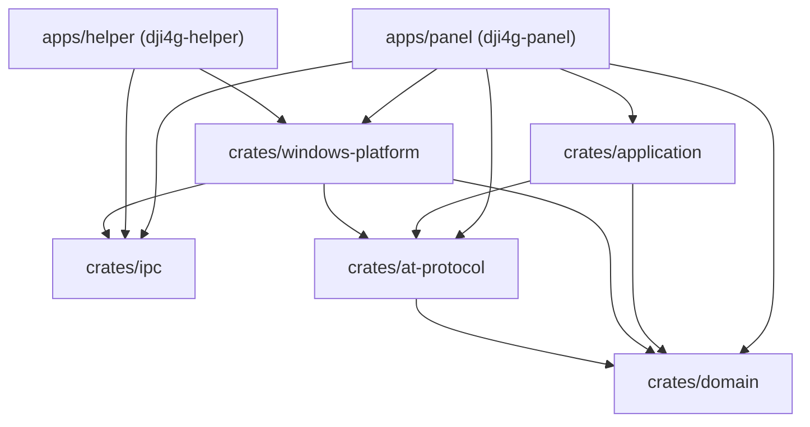
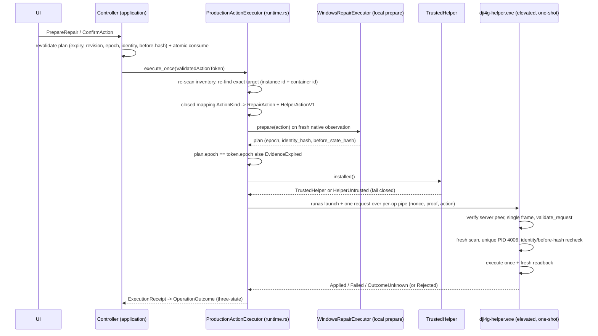

# Architecture

This document describes the as-built architecture of the DJI first-generation 4G panel workspace. It is the developer-facing companion to the design specification (`docs/superpowers/specs/2026-09-03-dji4g-gen1-panel-design.md`); where the two differ, this document describes what the code actually does and the divergence is called out in the last section.

Product invariants that shape every layer:

- The only supported target is the exact USB identity `USB\VID_2CA3&PID_4006` (`dji4g_domain::DJI_GEN1`) and its exact network adapter (GUID/LUID). FriendlyName matching and system-default-route fallbacks do not exist.
- AT commands are a closed whitelist enum; repairs are a closed typed set. There is no raw AT or arbitrary shell path.
- Every state-changing operation re-enumerates the exact target, verifies epoch + identity + before-state hash, requires explicit confirmation, executes exactly once, reads back fresh state, and yields one of `Applied / Failed / OutcomeUnknown`. Non-repeatable operations are never auto-retried.
- Without an installed, signature-verified helper the privileged path fails closed.

## 1. Workspace and crate map

| Path | Crate | Role | Internal dependencies |
| --- | --- | --- | --- |
| `apps/panel` | `dji4g-panel` | egui/eframe GUI, tray, single instance, autostart, config, privacy-safe logging, and the production composition (`src/runtime.rs`) | application, at-protocol, domain, ipc, windows-platform |
| `apps/helper` | `dji4g-helper` | One-shot elevated helper: parses exactly three internal flags (`--pipe`, `--nonce`, `--protocol`) and delegates to `dji4g_windows_platform::run_helper_once` | ipc, windows-platform |
| `crates/domain` | `dji4g-domain` | Pure models: `DJI_GEN1` profile, `DeviceEpoch`, `StableDeviceIdentity`, evidence/freshness types, action safety rules, and the availability classifier (`availability.rs`) | none |
| `crates/application` | `dji4g-application` | Orchestration: port traits (`ports.rs`), pure reducer (`reducer.rs`), controller and confirmation/plans (`controller.rs`, `confirmation.rs`), refresh runner (`monitor.rs`) | domain, at-protocol |
| `crates/at-protocol` | `dji4g-at-protocol` | Typed AT command whitelist, streaming parser, PDP context model, log redaction | domain |
| `crates/ipc` | `dji4g-ipc` | Panel/helper wire protocol: closed request/response enums, validated newtypes (nonce, pipe name, hashes, APN, DNS list), framing, request validation, peer expectations | none (standalone) |
| `crates/windows-platform` | `dji4g-windows-platform` | All Win32/COM/WinRT adapters: PnP inventory, adapter resolver, bound network probes, serial AT actor, hotspot control, native repair backend, privilege/elevation transport, tray, autostart, single instance | domain, at-protocol, ipc |

Dependency direction (actual `Cargo.toml` graph):



Key properties:

- `application` never depends on `windows-platform` or `ipc`. It owns port traits only; concrete Windows backends are injected at the panel composition boundary (section 2). This keeps the direction one-way and keeps the orchestration core testable without hardware.
- `helper` links no UI code and cannot render anything; it exposes no open-ended command surface.
- `ipc` is deliberately standalone (serde + getrandom only) so the wire contract cannot silently grow domain coupling.

Platform spikes live in `apps/panel/src/bin/` (`pnp_spike`, `bound_probe_spike`, `hotspot_spike`); AT parser fixtures live in `tests/fixtures/at/`; hardware acceptance material lives in `tests/hardware/`.

## 2. Ports and adapters: the production composition

`crates/application/src/ports.rs` defines the port traits the application core consumes:

- `InventoryPort` (PnP scan), `AtPort` (AT observation + epoch invalidation), `AdapterPort` (exact adapter resolution), `NetworkProbePort` (adapter-bound probes), `HotspotControl` (observe / revalidate / toggle), `ActionExecutor` and `PrivilegedExecutor` (confirmed writes), `Clock`.
- `MonitorPorts` bundles the five observation ports for one refresh DAG.

`apps/panel/src/runtime.rs` contains `ProductionComposition`, the only place where concrete Windows backends are wired:

| Port | Production adapter | Backing implementation |
| --- | --- | --- |
| `InventoryPort` | `ProductionInventory` | `WindowsDeviceInventory` (SetupAPI/Configuration Manager); owns epoch bookkeeping |
| `AtPort` | `ProductionAt` | Fresh `AtSessionActor::open_selected` per observation, with safe handshake; no cached serial session |
| `AdapterPort` | `ProductionAdapter` | `WindowsAdapterResolver` (GUID/LUID mapping, never FriendlyName) |
| `NetworkProbePort` | `ProductionProbe` | `WindowsNetworkProbe::observe_now` bound to the freshly resolved `AdapterIdentity` |
| `HotspotControl` | `ProductionHotspot` | `WindowsHotspotControl` (WinRT tethering) + `WindowsRepairExecutor` for before-state proofs |
| `ActionExecutor` / `PrivilegedExecutor` | `ProductionActionExecutor` | `execute_via_helper` (section 5) |
| `Clock` | `SystemClock` | Real wall + monotonic time |

Because the composition lives in the panel binary rather than in `application`, the ordinary executable path **cannot** select the deterministic test controller: `Controller::for_test` / `FakeActionExecutor` are used only by unit/integration tests and by the `--demo` snapshot path, which exists solely under `debug_assertions` and is rejected outright in release builds (`apps/panel/src/main.rs`). `apps/panel/tests/production_runtime.rs` pins this contract, including the fail-closed behavior of `TrustedHelper::installed()` outside a signed install.

Notable adapter details:

- `ProductionAt::invalidate` is a provable no-op: every observation opens a brand-new actor bound to the current epoch and drops it before returning, so no stale session can survive an epoch change.
- `ProductionProbe::observe` with active probing disabled performs no network I/O and reports an explicit `Unexecuted` stage (`probe:disabled_by_setting`) instead of a fake pass/fail. When enabled, a GUID mismatch between the freshly resolved adapter and the bound adapter id is treated as identity drift (`probe:route_identity_mismatch`) and fails closed. The global default route is carried in `SystemRouteDto` with `explanation_only: true` — it can explain VPN/TUN competition but never counts as module evidence.
- `ProductionHotspot::revalidate_toggle` derives the before-state hash from a fresh native observation using the same `WindowsRepairExecutor` the elevated helper applies at execution time; no fixed or zero hash is ever produced.
- `ProductionHotspot::set_enabled_once` routes the confirmed toggle through the elevated-helper path because the in-process WinRT tethering future is not `Send`; the token's direction is cross-checked and a mismatch fails closed.

## 3. Threading model and refresh DAG

The UI thread runs eframe/egui and never blocks on device, serial, DNS, route, or hotspot work. It holds a `ControllerHandle` and communicates in two directions only:

- Commands: bounded `mpsc` queue (`COMMAND_QUEUE_CAPACITY = 32`) plus a coalescing `RefreshSignal` (`AtomicBool`), so a burst of refresh requests collapses into one cycle.
- Snapshots: a watch channel of immutable `Arc<ControllerSnapshot>` values; the UI renders snapshots and owns no handles or locks held by backend work.

A dedicated thread named `dji4g-controller` (spawned in `main.rs`) drives `ControllerRunner::run` (`crates/application/src/monitor.rs`). The loop blocks on `commands.recv_timeout(IDLE_POLL_INTERVAL)` with `IDLE_POLL_INTERVAL = 20 ms`: a bounded idle wait, not a busy-spin (the thread stays parked between polls), so a tray-resident panel does not burn a CPU core; command latency stays within one interval, so a prepare dispatched by a button click is handled almost immediately while the native confirmation box that opened at click time is still on screen.

Each pass runs a cycle when the coalesced `RefreshSignal` is set **or** when the automatic monitoring cadence is due (`REFRESH_INTERVAL = 10 s`, decided by the pure `periodic_refresh_due`). The cadence exists because evidence expires after `EVIDENCE_TTL = 30 s`: a panel that scanned only on an explicit user command could never hold a fresh classification — it decayed to `Stale` half a minute after the one manual scan and never recovered, and a module plugged in after startup was never noticed at all. The first pass is always due (`last_refresh_at == None`), so every build configuration collects evidence at startup without waiting for a user to press 刷新; the previous startup `Refresh` was gated behind `debug_assertions`, which left a packaged release build permanently in its initial `Detecting` state with no recorded evidence even while the module was present and working. The cadence is skipped for a portless runner (deterministic test/demo backend), and it drives read-only observation ports only, so the rule that a non-repeatable write executes at most once and is never automatically retried is unaffected.

The automatic cadence additionally **yields** while an explicit user interaction is in flight (`Controller::interaction_in_flight`): a plan still `AwaitingConfirmation` inside its `PLAN_LIFETIME`, or an operation still `Running`. Every scan records fresh evidence and therefore bumps `evidence_revision`, and any revision bump invalidates a plan awaiting confirmation, so an unconditional timer would tear down a repair the user is about to confirm every interval. Yielding does not weaken safety — `confirm_action` still re-validates expiry, evidence revision, epoch, target identity, and the before-state hash, and the executor re-enumerates the exact target before acting — and the window is bounded by the plan's own `expires_at`, so a plan the user prepares and abandons can never stall monitoring. An explicit user-initiated refresh is deliberately *not* suppressed: refreshing mid-confirmation is the user saying the ground may have moved, and invalidating the plan is the intended response.

One refresh cycle runs the observation DAG strictly in order, feeding each result to the pure reducer as a `BackendEvent`:

```text
RefreshStarted(cycle, epoch)
        |
        v
inventory.scan()            fresh SetupAPI/CM scan; ProductionInventory owns the epoch
        |
        v
InventoryFinished ---------> no device present: short-circuit to RefreshFinished
        |
        v
at.observe(target)          fresh AtSessionActor on the validated AT port (safe handshake)
        |
        v
AtFinished
        |
        v
adapter.resolve(target)     exact adapter by GUID/LUID via WindowsAdapterResolver
        |
        v
AdapterFinished
        |
        v
probe.observe(adapter, active)
        |                   active probing off -> Unexecuted(DisabledBySetting), no I/O
        v
ProbeFinished
        |
        v
hotspot.observe(adapter)    WinRT tethering status for the exact source adapter
        |                   no adapter/port -> Unavailable(app:hotspot_unavailable)
        v
HotspotFinished -> RefreshFinished -> publish snapshot
```

Stages never run in parallel and never skip the inventory step: the target context used by AT/adapter/probe/hotspot is derived from the freshest inventory result of the same cycle, and each stage's `CheckResult` (`Passed / Failed / Unavailable / Unexecuted`) is recorded with its `observed_at` timestamp.

## 4. Evidence, epochs, and availability classification

**Epochs.** `ProductionInventory` increments `DeviceEpoch` whenever the exact device disappears, reappears, or its stable identity (ContainerId + device instance id + VID/PID) drifts. Every observation and every piece of evidence carries the epoch it was produced under.

**Freshness.** The reducer (`crates/application/src/reducer.rs`) stores evidence with a TTL (`EVIDENCE_TTL = 30 s`) and derives snapshot `Freshness` (`Fresh / Stale / Unknown`). Positive evidence expires; a stale green state is removed rather than re-displayed, and any non-device evidence that is stale relative to the current epoch forces the classifier back to `Detecting`.

**Classification.** `crates/domain/src/availability.rs::classify` is a pure function over `ClassificationInput`. In order:

1. No fresh PnP presence evidence -> `Detecting`. `NotDetected` presence (a successful enumeration proving PID 4006 absent) -> `NotDetected`; out-of-scope device -> `UnsupportedDevice`; permission denial -> `Detecting` (an error, not absence).
2. Phase not `Stable` (startup, recent insertion, re-enumeration, post-write verification) -> `Detecting`.
3. No fresh, supported target identity -> `Detecting`; any stale non-device evidence -> `Detecting`.
4. No valid adapter binding for the target -> `Limited(IncompleteEvidence)`; a definitive cellular block -> `Unavailable(CellularRejected)`; no usable address/route -> `Unavailable(NoUsableAddressOrRoute)`.
5. Bound public probe succeeded -> check bound DNS (`Failed` -> `Limited(DnsFailure)`), protocol coverage (`SingleFamilyOnly` -> `Limited(SingleProtocolFamily)`), default-route owner (`VpnOrTun` -> `Limited(CompetingDefaultRoute)`, explanation only), AT control availability (`Unavailable` -> `Limited(AtControlUnavailable)`); all pass -> `Available`.
6. Bound public probe failed across two consecutive cycles -> `Unavailable(BoundPublicProbeFailed)`; incomplete/single failure -> `Limited(IncompleteEvidence)`; no bound evidence at all while the system is globally online -> `Unavailable(NoBoundReachability)` — the global state proves the module path is *not* the one working, never that it is.

Bound evidence is accepted only when its `AdapterBinding` equals the currently proven binding, so a phone hotspot, ordinary Wi-Fi, or a Meta/Clash TUN adapter cannot contribute to `Available`.

**Naming a known AT fault.** Every point where the classifier would otherwise report `Limited(IncompleteEvidence)` is reached only after the device has already been recognised (supported PnP presence, a fresh supported target identity, and phase `Stable`). At those points `incomplete_evidence` first checks whether AT control is *definitely* known unavailable for the current epoch — a fresh, `EvidenceSource::AtControl`-sourced `AtControlAvailability::Unavailable`, which is what the reducer records when `select_at_port` fails with `pnp:no_safe_at_port` because the module's serial/AT interfaces are in an error state. When it is, the verdict becomes `Limited(AtControlUnavailable)` so the user is told which capability is broken instead of seeing the generic 「现有证据不足」, which reads as "still working on it". This is fail-closed by construction: it only ever substitutes one `Limited` reason for another, so it can never produce `Available`, and each definite `Unavailable` verdict (`CellularRejected`, `NoUsableAddressOrRoute`, `BoundPublicProbeFailed`, `NoBoundReachability`) is decided before these branches are reached and is therefore never masked. A missing, stale, or wrongly-sourced AT observation yields `false`, so an explanation is never invented from absent evidence.

## 5. Controlled repairs and the privileged action flow

### 5.1 Confirmation and plans (application crate)

`Controller::prepare_action` builds an `ActionPlan` from a specific snapshot revision: it checks action prerequisites, requires a proven target identity, computes a `BeforeStateHash` from current evidence, and stores the plan with a 30 s lifetime (`PLAN_LIFETIME`). Any evidence revision change, epoch change, or device removal invalidates a pending plan. `Controller::confirm_action` re-validates expiry, evidence revision, epoch, target identity, and before-state hash, then **atomically consumes** the plan id (recorded in `consumed_plans`, so the same id can never execute twice) and mints a `ValidatedActionToken` for exactly one execution.

`ControlledRepairRequest` is the closed UI-facing repair set: `RefreshDhcp`, `ApplyDnsProfile`, `RestartAdapter`, `ReenumerateDevice`, `SetUsbNetProfile` (only `DjiNdis`=`usbnet 0` / `Ecm`=`usbnet 1`), `SetApn` (validated `PdpContextId` + `Apn` newtypes), `RestartModule`, `ToggleHotspot`. APN/DNS payloads are validated at the boundary and redacted in every `Debug` representation.

### 5.2 End-to-end privileged flow



Step by step (`execute_via_helper` in `apps/panel/src/runtime.rs`):

1. **Re-find the exact target.** A fresh `WindowsDeviceInventory` scan must yield exactly one device matching the token's device instance id and ContainerId; zero or multiple matches fail (`pnp:target_not_found` / `pnp:ambiguous_device`).
2. **Closed mapping.** `repair_action()` and `helper_action()` map the domain `ActionKind` onto the typed `RepairAction` and the wire `HelperActionV1` allow-list. `ActionKind::Refresh` is rejected (`app:refresh_not_action`); out-of-range CID/APN values are rejected; no raw string, path, or command ever crosses the boundary.
3. **Trust gate first (fast fail).** `TrustedHelper::installed()` requires a canonical helper path under Program Files with a verified Authenticode signature; otherwise the operation fails before any serial/scan work. A portable development build — this process itself carries no Authenticode signature (`is_dev_build()`) — may instead proceed with `TrustedHelper::dev_sibling()`: the unsigned sibling helper, digested but not signature-verified, with the confirmation modal showing an explicit development-only warning. A signed installation can never take that path.
4. **Fresh local prepare.** `WindowsRepairExecutor::new(WindowsNativeRepairBackend::with_epoch(token.epoch())).prepare(action)` recomputes the authoritative identity hash and action-specific before-state hash from a *fresh* native observation; the plan epoch must still equal the token epoch, the plan's target identity hash must equal the hash of the freshly re-found device, and the plan's action must equal the confirmed action.
5. **One bounded request.** `build_helper_request` attaches a random `OperationNonce`, random `RequestId`, issued/expiry timestamps (lifetime = `MAX_OPERATION_LIFETIME` = 60 s), and `TargetProofV1 { profile: DjiGen1, epoch, identity_hash, before_state_hash }`. `launch_elevated_helper` re-validates the request, creates the per-operation pipe (random name, local-only, single instance, DACL limited to the current user + Administrators + SYSTEM), launches the helper with `runas` (a cancelled UAC prompt becomes `privilege:operation_cancelled` — a definite outcome, never a retry), verifies the elevated peer (PID, creation time, user SID hash, session, High integrity, image SHA-256), sends exactly one request, and waits bounded for the helper process to exit.
6. **Helper-side re-verification.** `run_helper_once` verifies the panel-side peer (Medium integrity, panel image hash), reads exactly one frame (a second frame is a protocol violation and is rejected before any enumeration), and `validate_request` re-checks version, nonce equality, non-zero ids, expiry, lifetime, and clock skew. `inspect_or_reject` then requires the `DjiGen1` profile, performs its **own** fresh inventory scan (exactly one PID 4006 device), compares the authoritative identity hash against the request proof, and rejects a zero before-state hash.
7. **Execute once, three-state result.** `execute_repair_once` prepares the same action again through the same executor, compares epoch + identity hash + before-state hash against the request proof (`EpochChanged` / `TargetIdentityChanged` / `BeforeStateChanged` abort without acting), executes exactly once, reads back, and returns `Applied { after_state_hash, verified_at }`, `Failed { code, rollback }`, or `OutcomeUnknown { code }`.
8. **Receipt mapping.** `map_helper_response` converts the wire result into an `ExecutionReceipt`; `Rejected` becomes a definite `PortError`, and the controller's `map_execution` maps transport timeouts to `OutcomeUnknown` (never to success or silent failure). An `Applied` receipt without an after-state hash is downgraded to `OutcomeUnknown`.

### 5.3 Why the panel recomputes the same hashes the helper verifies

Both sides run the *same* code — `WindowsRepairExecutor` over `WindowsNativeRepairBackend`, with the same versioned hash material (`dji4g-repair-identity-v1`, `dji4g-repair-before-v1`, `dji4g-identity-v1` in `crates/windows-platform/src/repair.rs`). The hashes are therefore deterministic functions of fresh native observations, not UI assertions:

- The panel computes them from a fresh prepare immediately before launch, so the confirmation dialog, the token, and the wire proof describe the state as it is *now*, not as it was when the plan was prepared.
- The helper recomputes them after elevation, so any change between confirmation and execution — replug, re-enumeration, adapter state change, DNS profile drift, a different device answering — produces a hash mismatch and aborts the operation before any side effect. This closes the TOCTOU window across the privilege boundary.
- Because the helper never trusts a display name, COM number, GUID, or path from the panel, a compromised or buggy panel process cannot aim an elevated write at anything except the single, freshly proven `VID_2CA3&PID_4006` device in the exact state the user confirmed.

## 6. Fail-closed philosophy

Every ambiguous, unverifiable, or stale condition resolves to "do not act / do not claim green":

- No fresh evidence -> `Detecting`, never `Available`. Expired positive evidence is dropped before refresh.
- Global connectivity or a PDP address alone never proves module availability; only adapter-bound evidence does.
- Active probing disabled -> explicit `Unexecuted` stages, never fabricated results.
- Identity drift between resolve and probe/hotspot stages -> hard error, no fallback adapter.
- No installed, signature-verified helper -> `privilege:helper_untrusted`/`helper_unsigned`; a signed installation always fails closed. Only a portable **development build** (the panel itself unsigned, `is_dev_build()`) may elevate its unsigned sibling helper, and the confirmation dialog then states the development-only warning explicitly.
- UAC cancelled -> definite `OperationCancelled` outcome; timeouts -> `OutcomeUnknown`; neither is auto-retried.
- Wire requests with unknown fields, oversized frames, expired lifetimes, wrong nonces, second frames, or second clients are rejected before any device access.

**Before-state scope (action-relevant):** the repair before-state hash covers only the fields the action itself depends on (device identity and epoch always; adapter identity/link for DHCP and adapter restart; the DNS profile for DNS changes; the target PDP context for APN writes; the hotspot source/capability/status for hotspot toggles). Unrelated live state — PDP context churn, DNS values, hotspot client counts, a bumped revision — that legitimately moves while the elevation prompt is open cannot fail a wanted repair. The device identity and epoch checks stay absolute, so a replug or different device still aborts before any side effect.

## 7. Packaging and distribution posture

- `packaging/msix/Package.appxmanifest`: identity `Dji4GPanel` 0.1.0.0 x64, `Windows.Desktop` family (min 10.0.19045), `runFullTrust` + `wiFiControl` capabilities, `mediumIL` trust level, `AppListEntry="none"` (tray-style app), `StartupTask` declared **disabled by default**, zh-CN/en-US resources.
- `packaging/scripts/build-msix.ps1` builds both `dji4g-panel.exe` and `dji4g-helper.exe` (release, `x86_64-pc-windows-msvc`, `--locked`) and packs `Dji4GPanel-0.1.0.0-unsigned-development-only.msix` into `dist/` by default. Both executables are staged into the package, and a BOM-less SHA-256 manifest (whole-package hash, per-file hashes, package identity, source commit) is written alongside the artifact for `packaging/scripts/verify-release.ps1` to validate. The project produces **unsigned development candidates only** — nothing is signed, published, or store-listed, and no certificate is generated or installed. An unsigned packaged development build can use the development-mode exemption (section 6) with the explicit modal warning; a packaged helper is still not a substitute for a signed Program Files installation, and `TrustedHelper::installed()` continues to fail closed for it.

## 8. Divergences from the 2026-09-03 design spec

Recorded for accuracy; none of them relax a safety invariant:

1. The spec's dependency sketch shows `ipc -> domain`; the actual `dji4g-ipc` crate is standalone (serde/getrandom/thiserror only).
2. The AT whitelist implemented in `crates/at-protocol` is narrower than the spec's candidate list: no `AT+GSN`/`AT+CGSN`, no `AT+CGREG?`/`AT+CREG?` fallbacks, no `AT+CGCONTRDP`, no `AT+QNWINFO`. Reads that the production composition performs are `CPIN?`, `CSQ`, `COPS?`, `CEREG?`, `CGATT?`, `CGDCONT?`, `CGACT?`, `CGPADDR`.
3. The spec describes one long-lived `AtSessionActor` owning the serial handle; production opens a fresh actor per observation and drops it (justified and pinned by tests in `runtime.rs`), so `invalidate` is a documented no-op.
4. The spec sketches a Tokio runtime on a named background thread; the production controller thread drives the refresh DAG synchronously with a bounded `recv_timeout` idle wait, and Tokio/WinRT async is used only inside the windows-platform hotspot backend.
5. The spec places low-risk repairs (DHCP renew, hotspot start/stop) in-process; the production executor runs the hotspot toggle in process (it needs no elevation) and routes every other confirmed write through the elevated-helper path, whose metadata now marks `RenewDhcp` as requiring elevation to match reality. In a signed installation every elevated write still requires the signed, Program Files-installed helper; an unsigned development build may use the documented development-mode exemption with an explicit warning.
6. The spec promises Simplified Chinese and English UI from the first release; the localization layer models `Language::EnUs` but `english_available()` returns `false` and only the Simplified Chinese catalog is exposed — English is deliberately not selectable until a complete English review exists.
